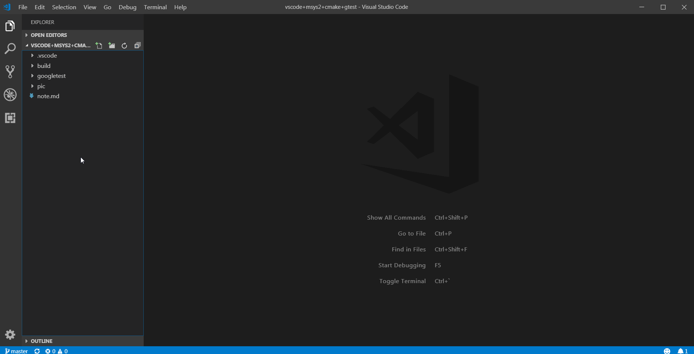

# 1 适用范围
1. 用vscode来diy低配版ide
2. 搭建gtest环境

# 2 简介
最近公司安排学习单元测试用到了gtest框架，趁着这个机会，尝试用vscode搭建一个环境用来学习，写下笔记方便以后复习，下面先简单介绍用到的工具。

    定一个小目标：用mingw-gcc编译程序，用快捷键来构建并运行程序。

## 2.1 vscode
微软发布的类似eclipse的前端软件，最基本的功能就是看代码和写代码，但是也可以配置工具链等外部工具，实现编写/编译/调试一体化的功能，之所以不用eclipse而选择它的原因很大因素是因为——颜值。

Download URL: https://code.visualstudio.com/
## 2.2 MSYS2 & MinGW

历史发展族谱：Cygwin -> MSYS -> MSYS2

Cygwin项目的目的是提供运行于Windows平台的类Unix环境，为了达到目的，Cygwin提供一套抽象层dll，用于将部分Posix调用转换成Windows的API调用,实现相关功能。

MSYS是精简版的Cygwin，因为MSYS不怎么更新，所以MSYS2是较新精简版的Cygwin。

MinGW是用于进行Windows应用开发的GNU工具链（开发环境），编译出来的应用可以直接在windows上运行。MSYS2里面就有MinGW，所以不需要额外下载。

相关介绍可以参考知乎大神:https://www.zhihu.com/question/22137175/answer/90908473

Download URL: http://www.msys2.org/

## 2.3 gtest
gtest是google公司开发的一个开源的单元测试框架，基于C++开发，可对C++语言和C语言进行单元测试。

Download URL: https://github.com/google/googletest

## 2.4 CMake

摘自百度：CMake是一个跨平台的安装（编译）工具，可以用简单的语句来描述所有平台的安装(编译过程)。他能够输出各种各样的makefile或者project文件，能测试编译器所支持的C++特性,类似UNIX下的automake。

Download URL: 等一下在MSYS2下直接用pacman下载安装，否则还要重新编译源码。

# 3 环境搭建

## 3.1 工具安装

1. vscode的安装教程网上有很多，就不讲了。
2. MSYS2的安装教程官网有详细步骤，也不讲了。
3. CMake需要先安装完MSYS2，在MSYS2终端输入命令行进行安装：pacman -S mingw64/mingw-w64-x86_64-cmake
4. MinGW需要先安装完MSYS2，在MSYS2终端输入命令行进行安装：pacman -S mingw64/mingw-w64-x86_64-gcc

## 3.2 修改vscode的默认shell
默认情况在windows下，vscode的终端shell是power shell，所以我们需要将它换成MSYS2的bash。

## 3.3 用CMake生成gtest的库文件
因为从github下载的是gtest的源码，无法直接使用，所以我们需要先编译出两个重要的库文件，包括libgtest.a和libgmock.a，按照github上的readme提示，我们可以直接用cmake来帮我们完成这些操作。

注：-Dgtest-build_samples=ON帮助我们生成几个例程，可以用来验证是否成功使用gtest，之所以出现?[0;32m这种乱码是因为终端不支持颜色转义代码，具体是为什么我也不清楚，但是在运行时候可以添加--gtest_color=no来关掉这些颜色输出。

## 3.4 生成/运行测试程序
下面就把libgtest.a和libgmock.a链接到我们自己写的单元测试代码，生成对应执行程序。

## 3.5 vscode的tasks初体验
tasks是vscode里面的工具，它代表一系列的任务，可以看成是一个个的脚本，这里我们运用它来实现构建和执行程序。

## 3.6 设置快捷键
为了让我们的vscode更像一个ide，我们给刚刚的任务设置一组快捷键，实现“一键编译+运行”的效果。

# 4 总结
整个学习过程花了差不多两天的时间，主要还是vscode的环境搭建浪费了一点时间，具体原因是对mingw、msys、gcc、bash、shell、terminal之间的概念不熟悉导致，现在已经有了一定程度的认知，但是还是有不清楚的地方。
1. 为什么终端无法识别颜色的转义代码，shell和terminal不能分开设置吗？
2. 为什么MSYS2的TERM变量是cygwin，而MINGW的TERM是xterm？

后面有更深的认知再回来看看吧。

# 5 参考资料

## 5.1 GCC & clang on windows with Visual Studio Code + bash terminal + debugging!

https://www.youtube.com/watch?v=TLh--v8OxHE
